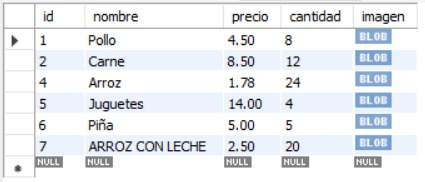
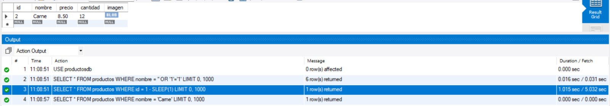
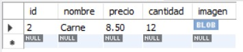
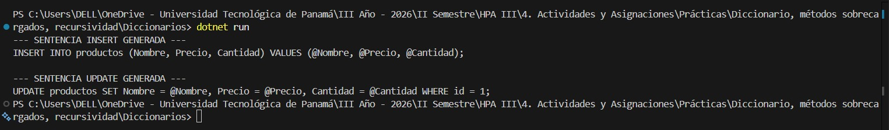
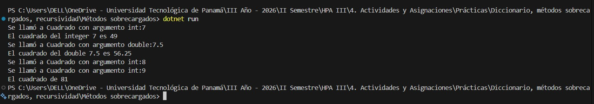
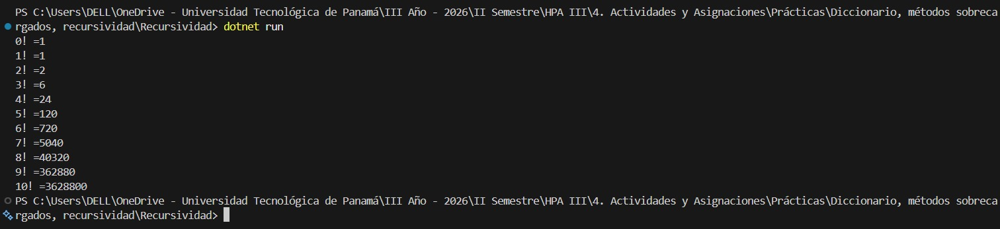
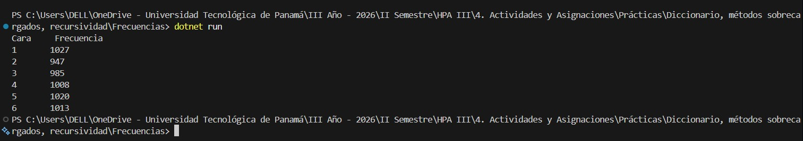

# Laboratorio - Temas Varios: Repaso del CRUD, Inyección SQL, Consultas Parametrizadas, Métodos Sobrecargados, Recursividad y Frecuencias
**Fecha:** 28/09/2026

---

## Contenido del Repositorio
Este laboratorio abarca el repaso práctico del acceso a bases de datos y la arquitectura de aplicaciones en capas utilizando C# y MySQL. Se aborda la manipulación de cadenas mediante la estructura de datos `Dictionary<string, object>` para la construcción dinámica de sentencias SQL (`INSERT` y `UPDATE`) parametrizadas en el programa `Diccionarios`, previniendo vulnerabilidades de Inyección SQL. Asimismo, se aplican conceptos avanzados de Programación Orientada a Objetos en C# como Métodos Sobrecargados (*Overloading*), algoritmos recursivos para el cálculo del Factorial ($n!$) y análisis de frecuencias sobre conjuntos de datos numéricos.

Debido a restricciones de la plataforma al subir directorios, los cuatro proyectos C# se incluyen comprimidos en formato `.zip` (`Diccionarios.zip`, `Frecuencias.zip`, `Métodos sobrecargados.zip` y `Recursividad.zip`). Además, se adjunta la base de datos relacional `productosdb.sql` y el script `Consultas Parametrizadas.sql`.

---

## Tecnologías Utilizadas
* **Lenguaje / Framework:** C# / .NET SDK 10.0 (.NET Framework / Console Applications)
* **Base de Datos:** MySQL Workbench
* **Herramientas:** Visual Studio Code, GitHub

---

## Capturas de Pantalla y Problemas

### Interfaz Principal / Salidas por Consola y MySQL

* **Problema #1: Consultas SQL (3 Consultas):** Ejecución de tres consultas relacionales dentro del script `Consultas Parametrizadas.sql` sobre la base de datos `productosdb.sql`.




* **Problema #2: Cadenas (Armando Update / Insert) y Consultas Parametrizadas (Programa `Diccionarios`):** Construcción dinámica de comandos `INSERT` y `UPDATE` en C# utilizando objetos `Dictionary<string, object>`. Las funciones `GenerarInsert` y `GenerarUpdate` formatean automáticamente los campos y agregan el prefijo `@` a los valores para generar marcadores de posición parametrizados, mitagando el riesgo de Inyección SQL.


* **Problema #3: Métodos Sobrecargados:** Creación de una clase con múltiples firmas para un mismo método, permitiendo procesar datos bajo distintas lógicas según los parámetros recibidos.


* **Problema #4: Recursividad (¡Factorial!):** Función recursiva para el cálculo del factorial ($n!$), controlando explícitamente el caso base para evitar desbordamientos de pila (*StackOverflowException*).


* **Problema #5: Frecuencia:** Algoritmo en C# para recorrer colecciones o arreglos numéricos, contabilizando la repetición de elementos y desplegando los resultados en consola.


---

## Estructura de Carpetas o Directorios

```plaintext
Laboratorio-TemasVarios/
├── img/                                 # Carpeta con las capturas de pantalla de evidencia
│   ├── problema1_consulta1_sql.png
│   ├── problema1_consulta2_sql.png
│   ├── problema1_consulta3_sql.png
│   ├── problema2_diccionarios.png
│   ├── problema3_metodos_sobrecargados.png
│   ├── problema4_recursividad_factorial.png
│   └── problema5_frecuencias.png
├── Consultas Parametrizadas.sql         # Script SQL con las 3 consultas parametrizadas
├── Diccionarios.zip                     # Proyecto C# comprimido (Problema #2 - CRUD Parametrizado)
├── Frecuencias.zip                      # Proyecto C# comprimido (Problema #5)
├── Métodos sobrecargados.zip            # Proyecto C# comprimido (Problema #3)
├── README.md                            # Documentación principal del repositorio
├── Recursividad.zip                     # Proyecto C# comprimido (Problema #4)
└── productosdb.sql                      # Base de datos MySQL requerida
```

---

## Instrucciones de Ejecución / Uso

1. **Clonar el repositorio:**
   ```bash
   git clone [https://github.com/jacu2006/Laboratorio-TemasVarios.git](https://github.com/jacu2006/Laboratorio-TemasVarios.git)
   cd Laboratorio-TemasVarios
   ```
   
## Configuración de la Base de Datos (MySQL)

1. Importar el archivo `productosdb.sql` en tu gestor de base de datos MySQL / MySQL Workbench.
2. Ejecutar el script `Consultas Parametrizadas.sql` sobre la base de datos importada para verificar las 3 consultas del Problema #1.

---

## Autor y Contexto
* **Nombre:** Javier Alberto Acuña Castro
* **Institución:** Universidad Tecnológica de Panamá (UTP) - Campus Víctor Levi Sasso
* **Facultad:** Facultad de Ingeniería en Sistemas Computacionales (FISC)
* **Curso:** Herramientas de Programación Aplicada III (.NET) - Grupo 1IL133
* **Instructor:** Ing. Irina Fong
* **Fecha de Realización:** 28/09/2026

---

## Referencias
* Guía de laboratorio: *Laboratorio de Temas Varios: Repaso del CRUD, Inyección SQL, importancia de las Consultas Parametrizadas, Métodos Sobrecargados, Recursividad y Frecuencias* - Ing. Irina Fong[cite: 47].
* Guía de Estandarización de Repositorios y Documentación con Markdown - FISC UTP[cite: 49].
* [Documentación Oficial de .NET y C# en Microsoft Learn](https://learn.microsoft.com/es-es/dotnet/csharp/)
